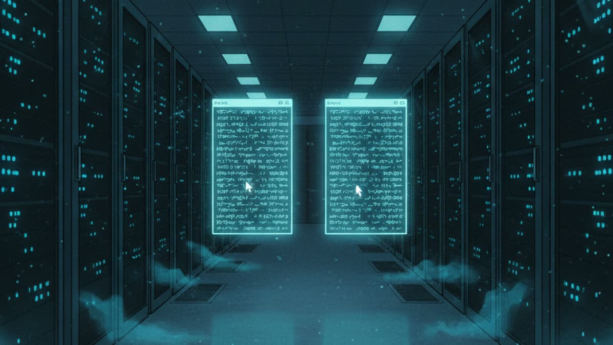

# Genga Studio

[](LICENSE)
[](https://github.com/ryan-the-brodsky/cutroom/actions/workflows/ci.yml)
[](docs/WEBMCP-PLAN.md)

> **Live demo:** [gengastudio.com](https://gengastudio.com) ·
> **Third-party code:** [`THIRD_PARTY_NOTICES.md`](THIRD_PARTY_NOTICES.md) ·
> **Prior work vs. new work:** [`docs/PRIOR-WORK.md`](docs/PRIOR-WORK.md)

Genga Studio is a hosted web application for making limited-animation films:
one server, N film projects, M pluggable generation backends. Anime on a
budget, the way anime always was. 原画 genga, the key drawings; an animator
draws the frames that matter and the studio fills the rest.

```
cutroom/
  server/    FastAPI app + engine library + adapters + job queue  (python)
  web/       React/Vite SPA                                       (typescript)
  deploy/    Dockerfile · docker-compose · env template
  docs/      ARCHITECTURE.md · BACKENDS.md · DEPLOYMENT.md
  dev.sh     run on this machine
```

## Quick start (local)

```bash
./dev.sh build       # build the SPA into the server (one-time / on UI change)
./dev.sh server      # http://127.0.0.1:8770
```

`/` is the public landing page (what Genga Studio is, the demo film, how the WebMCP
layer works). The studio itself lives at **`/app`**, and old deep links
(`/p/…`, `/jobs`, `/settings`) redirect there. Opening a film (`/app/p/<id>`) lands on
its **Timeline** — the film as real clips, previewed with sound; the Film Editor board
keeps its own path at `/app/p/<id>/film`. The landing page registers the
same WebMCP tools, so a visitor who lands on `/` can ask the page what it does.



Then in the UI: **Projects → Import** with the path to a **studio folder** (a
directory holding `prompts/shots.jsonl`, `renders/`, `audio/`; the layout is
documented in [`docs/ARCHITECTURE.md`](docs/ARCHITECTURE.md)). Shots, keepers,
overrides, comps and every take come in with their lineage. Point a ComfyUI
install at the `local-comfyui` backend and it serves the still/i2i/motion
lanes over HTTP upload/download, so a remote ComfyUI works just as well as a
local one.

Dev mode with hot reload: `./dev.sh` (API :8770 + vite :5173).

## What it does

- **Storyboard / shot lab** — takes galleries, keeper curation (with
  history), reference attach, per-shot generation console with **model
  pickers**: every lane (still · img2img · motion · voice) is served by a
  configurable backend; ComfyUI backends list their installed checkpoints
  live, ElevenLabs lists your voices.
- **The cel system** — comps = an untouched background plate + z-ordered
  animated cel layers. Draw a region on the plate, give the cel a motion
  prompt; layers reroll independently; the background restyles under
  persistent layers (low denoise keeps staged geometry). Deterministic
  re-render from the data model.
- **Motion edits as repair, not as policy** — the live window is a property of
  the backend (about a second on the local LTX rig, three to five on hosted
  Wan-class models), carried as a `motion_profile` on the backend row, so clips
  play in full at the model's own length. When a clip *does* drift after N
  seconds, freeze-tail (a **true freeze**, the same frame repeated, never a slow
  zoom or a boiling loop), breath-stitching chains and trims keep the good
  frames instead of rerolling. The 2026-07 FIRST-SECOND LAW was the local
  model's ceiling, not a law.
- **A motion budget you can hand to the agent** — `plan_motion` ranks the shots
  worth animating and fits them to a dollar figure at the backend's real price;
  `apply_motion_plan` spends it; `GET /api/projects/{id}/spend` says what the
  film has cost, by lane and by backend.
- **Natural-language direction** — instructions compile to previewable
  **EditPlans** (a validated ops vocabulary). The deterministic grammar
  handles the documented edit language with zero API keys ("keep the first
  second", "hold his pose for the rest of the line" — it probes the real VO
  duration); an Anthropic/OpenAI-compatible planner handles the rest.
  Director chat gives Claude hosted-safe *function tools* (inspect the film,
  run plans) — no shell in hosted mode; `claude-cli` power mode exists for
  self-hosts (`CUTROOM_ALLOW_CLAUDE_CLI=1`).
- **Voice, treated or clean** — a shot's `narration` line (plus its in-scene
  `dialogue`) goes to the voice lane; `treatment` names what it is heard
  through — radio, phone, megaphone, a room — and defaults to none, because the
  platform has no house sound. The untreated take is always kept.
- **Panel screens** — the Ping Pong/Dezaki grammar as a render job
  (spec JSON → mp4 + SFX cue sidecar).
- **Cut the film** — the assembler builds the animatic from current state
  (keepers + overrides + takes): true still holds, last-frame freezes for
  short clips, VO placed with audio-fit + head pad, slate for missing shots.
- **Jobs** — DB-backed queue; GPU backends run strictly serial per backend
  (the 16GB discipline, generalized); CPU work runs parallel. Remote workers
  on GPU VMs claim jobs over HTTP (`cutroom-worker`).

## Drive Genga Studio with an agent (WebMCP)

**An agent made a film with this.** [Two Claudes](docs/demo-films/two-claudes/README.md)
is a 130-second limited-animation short. An agent produced it end to end on the
hosted demo through the page's own WebMCP tools: 15 shots, three frozen motion
bursts, 15 voice lines, a music bed, SFX cues, four assembler passes. 257 tool
calls, about $1.50, no pipeline script.

Genga Studio has about a hundred distinct actions across two rooms and five tabs,
and finding any of them means clicking. WebMCP lets the page hand an agent the
whole list instead.

One **action registry** (`web/src/agent/registry.ts`) is the single source of
truth for every feature: name, JSON Schema, where it lives in the UI, how a
human does it by hand, and how to run it. Three surfaces come off that one
list. **45 WebMCP tools** on `document.modelContext`, a ⌘K palette for humans,
and a "show me" behaviour that navigates to a feature and rings its control.

Tools execute **through the UI you are looking at**. `generate_takes` opens the
shot, switches to the Generate tab, fills the prompt, and presses submit, so
you learn the app by watching the agent drive it. Reads are the only silent
calls, an Agent trail logs every step, and paid backends refuse to spend
without an explicit `confirm_cost`.

Open the [live demo](https://gengastudio.com/app) (the Railway URL
<https://cutroom-production-0f3c.up.railway.app/app> still works) in
ChatGPT Desktop's browser (Settings › Browser › Enable site tools) or Chrome
149+ with `chrome://flags/#enable-webmcp-testing`, then ask:

> "Make a few more generative cuts of the two chairs shot."
> "Keep the first second of the letter flood and freeze the rest."
> "Cut the film."

Architecture and tool catalogue: [`docs/WEBMCP-PLAN.md`](docs/WEBMCP-PLAN.md).
Test evidence, the measured Chrome 152 API behaviour and the cross-client
checklist: [`docs/TESTING-WEBMCP.md`](docs/TESTING-WEBMCP.md).

## Verification status

- 36 pytest tests green (engine on synthetic media, API surface, direction
  grammar, fake-ComfyUI adapter, queue + remote-worker protocol).
- End to end on the sample film *Next Year*: imported 97 shots/567 takes/7
  comps; compiled and applied director grammar on a real shot; freeze-tail and
  comp re-render produced verified frames; **act 1 assembled to a 194s 720p
  animatic with 24 VO items**.

See `docs/ARCHITECTURE.md` for the design, `docs/BACKENDS.md` for adapter
configuration, `docs/DEPLOYMENT.md` for hosting.
