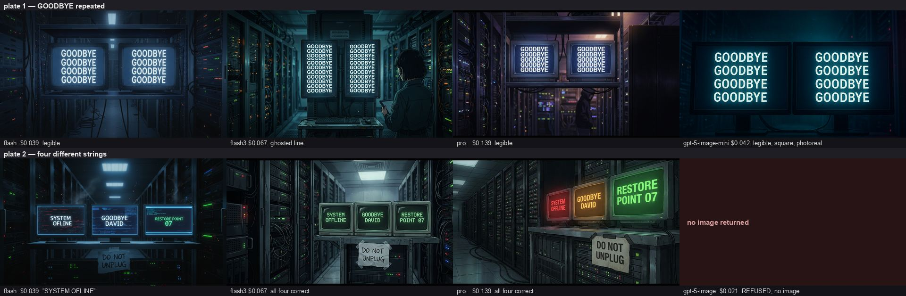

# Which image model can actually spell, 2026-09-02

**Nano Banana Pro (`google/gemini-3-pro-image`, "pro", $0.139/still) is the only
model that got both text plates right.** The cheap default spells one short word
fine but drops a letter the moment a frame carries several strings, and 3.1
Flash ghosted a repeated line. `openai/gpt-5-image` refused the plate on policy,
billed $0.021 and returned no picture at all. Default stays `flash`; ask for
`pro` when the letters have to be readable.

Six models on plate 1, three on plate 2, one still each, straight against
OpenRouter from a laptop, `image_config.aspect_ratio: "16:9"` on every request.
**Total spend: $0.585.** Prices are OpenRouter's own `usage.cost`, not quoted
list prices.

## The plates

| plate | prompt | what it tests |
|---|---|---|
| 1 | "Two matching monitors in a dark server room aisle; on both screens the single word GOODBYE repeated in large perfectly legible uppercase letters, one per line; cinematic anime film still" | **one word, repeated.** The owner's actual shot. |
| 2 | "…the left screen reads SYSTEM OFFLINE, the centre screen reads GOODBYE DAVID, the right screen reads RESTORE POINT 07; a paper sign taped to the rack below reads DO NOT UNPLUG…" | **four different strings in one frame,** plus small text on paper. |

## The table

| key | model | $/still | latency | plate 1 | plate 2 | judgement |
|---|---|---|---|---|---|---|
| `flash` | `google/gemini-2.5-flash-image` | **$0.0387** | 7–12 s | legible, well set, anime | **"SYSTEM OFLINE"**: a letter gone; drifted photoreal | **The default.** Cheapest and by far the fastest. Fine for one short word; it starts misspelling as soon as the frame carries more than one string. |
| `pro` | `google/gemini-3-pro-image` | **$0.1387** | 41–65 s | legible, cleanest anime of the six | **all four strings correct,** including the paper sign | **The one to ask for when text matters.** Only model perfect on both plates. Costs 3.6 flash stills, takes a minute, and bakes its own letterbox bars into the 16:9 canvas. |
| `flash3` | `google/gemini-3.1-flash-image` | **$0.0672** | 12–14 s | one repeated line **ghosted** into the one below it; invented a technician the prompt never mentioned | all four strings correct, anime held | **Middle rung.** Spells like pro on distinct strings at half the price, but repetition smears and it adds people and set dressing unasked. |
| not registered | `google/gemini-3.1-flash-lite-image` | $0.0336 | 3 s | legible, but **photoreal**, ignoring "anime film still" | not run | Cheapest and fastest of all, and it can spell. Rejected on register: this platform makes anime, and a model that will not stay in it is not a model this film can use. |
| not registered | `openai/gpt-5-image` | $0.0207 | 28 s | **refused**: "Sorry, I can't create images that include extensive on-screen text" | not run | **Rejected.** A policy refusal on the exact class of shot this registry exists for, and it billed for the refusal. |
| not registered | `openai/gpt-5-image-mini` | $0.0424 | 45 s | legible, but **1024×1024** (ignored the 16:9 request) and photoreal | not run | Rejected. Wrong aspect and wrong register; a film lane cannot use a square photoreal frame. |

## What went into the registry

Three records in `server/cutroom/adapters/image_models.py`: `flash` (rank 1, the
cheap default), `pro` (rank 2, claims `legible_text` / `typography` /
`complex_composition`), `flash3` (rank 3, `typography` /
`complex_composition`). Lite and both GPT models are deliberately absent; the
evidence stays here. Prices in the registry are the measured `usage.cost`
figures above, and the adapter now sends `usage: {include: true}` so a real
still records what it really cost rather than one flat guess per backend.

## Method

`/tmp/cutroom-U/measure.py` and `measure2.py`, one POST to
`https://openrouter.ai/api/v1/chat/completions` per model, `modalities:
["image", "text"]`, no references and no style frames, cost read from
`usage.cost` on the response. Stills are in `/tmp/cutroom-U/` and are not
committed; the contact sheet is. Nothing ran through the demo box.
