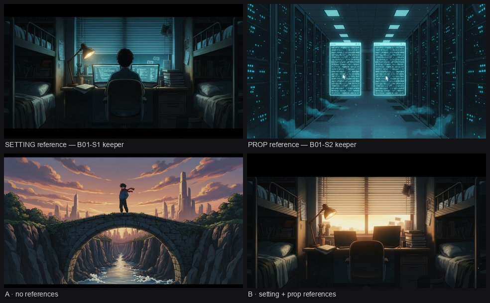

# Per-shot references, measured (2026-09-02)

One prompt ("the same dorm at dawn, the laptops closed"), one model
(`google/gemini-2.5-flash-image` through OpenRouter), run twice: without
references it drew a boy on a stone bridge and nothing of the film at all,
while with the *Two Claudes* dorm keeper attached as SETTING and a terminal
frame as PROP it drew the same room, the same bunks, lamp, blinds and stack of
books, lit by sunrise with both laptops shut and the chair empty. The one thing
to know before using it: the SETTING sentence says match this place's
architecture, layout **and light**, so the first attempt reproduced the night
lighting and the open laptops as well — the prompt has to say what CHANGED, in
plain words, for the change to survive the picture.

## What was run

| run | references | result |
|---|---|---|
| A | none | off-model entirely: a figure on a bridge over a gorge |
| B | setting + prop, prompt as written in the script | the dorm exactly, still night, laptops still open |
| C | setting + prop, prompt naming the change (DAWN, laptops CLOSED, nobody in the room) | the dorm at dawn, laptops shut, chair empty |

Three stills, $0.117 of OpenRouter spend (`usage.cost` 0.0389, 0.0387, 0.0394).
Panels A and B of the contact sheet are runs A and C; the full-size a/b is in
`/tmp/cutroom-S/`.

The request that produced C carried, in order: the SETTING role sentence, the
dorm image, the PROP role sentence, the terminal image, then the project style
prefix and the shot prompt with its `Avoid:` tail. The Take records it as
`params.references_used`, so any still can be traced back to the pictures that
shaped it.
